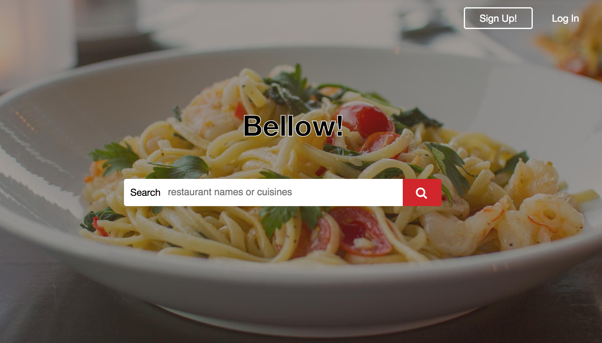
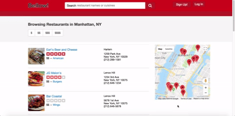
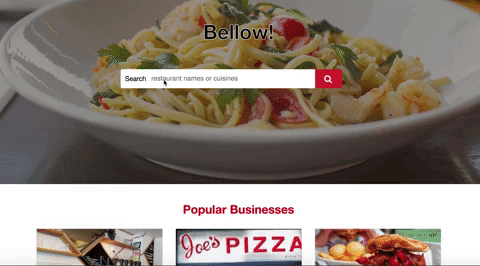

# Bellow!

Welcome to Bellow, a Yelp-like application that gives the power to the people when searching for the best places to eat. In Bellow, you are able to sign up, browse restaurants, write reviews, and filter for the perfect restaurant.

Visit the website here: [Bellow!](https://bellowtheapp.herokuapp.com/#/)

## Technologies
The application is a fullstack application that uses Rails for the backend and React-Redux in the frontend. By using rails, the application is able to authenticate user login information and handle requests to the database. JSON and jbuilder are used to pass data from the backend into the frontend. React and Redux then create a single page application for fast and seamless navigation. The app also implements Google Maps uses several of its features, such as tracking latitude/longitude changes and creating markers.

## Features
#### Core Features
There are several important features beyond being able to see a list of restaurants: user authorization, multiple avenues for site navigation, and the ability to select of multiple filters. A user is able to write, edit and delete their reviews. For filtering, a user is able to use a search bar, price filters, or both at the same time.

#### New Features!!
Two exciting features were added recently. 1) The ability to interact with the Google Maps API by hovering over markers to see which restaurant they belong to and clicking the marker to navigate to the restaurant's page. 2) By implementing the material-UI JavaScript library, the search bar now has a fuzzy filter that speeds up both search and navigation by pre-populating a list of results with clickable dropdown items that can take you to search results for the cuisine you're looking for or directly to a restaurant's page.

###### Map Marker Hover and Click

###### Search Bar Fuzzy Filter and Click

## Coming Soon
Updates to come will include a user profile page, the abilities to like reviews and "favorite" restaurants, and a filter for restaurants that are currently open.

I'm excited for you to explore the app and code, and I welcome any feedback you have!
